# A Hybrid Fuzzy AHP – Fuzzy ELECTRE Framework for Identifying Critical Stages of Post-Harvest Loss in the Malta (Citrus) Supply Chain of Uttarakhand

> **Thesis chapter — methodology, calculations, results and discussion.**
> Companion code: `code/fuzzy_mcdm.py` · Tabular outputs: `outputs/*.csv` · Figures: `figures/*.png`

---

## Abstract

This chapter develops and applies an integrated **Fuzzy Analytic Hierarchy Process (Fuzzy AHP)** and **Fuzzy ELECTRE I** framework to identify the most critical stages of the malta (sweet lime / *Citrus sinensis*) post-harvest supply chain in four Uttarakhand districts (Chamoli, Tehri Garhwal, Rudraprayag and Pauri Garhwal). Drawing on a 1 300-respondent stakeholder survey covering 82 cost, time and quality items spread across five supply-chain stages (Farm, Village Trader, Mandi, Retail and Transport), we (i) derive criterion priority weights using Buckley's geometric-mean Fuzzy AHP, (ii) build a fuzzy decision matrix grounded in observed response variability (Triangular Fuzzy Numbers, TFN, defined as `mean ± 1·SD`), and (iii) rank stages with Fuzzy ELECTRE I using vertex distance for discordance and weighted-sum concordance indices. The Buckley fuzzy weights are **w(Cost) = 0.519, w(Quality) = 0.308, w(Time) = 0.173** with a consistency ratio **CR = 0.0079 ≪ 0.10**. The final stage ranking is **Farm ≻ Mandi ≻ Transport ≻ Trader ≻ Retail**, and the ranking is fully invariant under ±30 % perturbations of every criterion weight, indicating high robustness. The Farm and Mandi stages emerge as priority intervention points for any post-harvest loss-reduction policy.

---

## Chapter outline

1. [Introduction](#1-introduction)
2. [Literature on Fuzzy MCDM](#2-literature-on-fuzzy-mcdm)
3. [Data and problem framing](#3-data-and-problem-framing)
4. [Methodology](#4-methodology)
5. [Application of Fuzzy AHP](#5-application-of-fuzzy-ahp)
6. [Application of Fuzzy ELECTRE I](#6-application-of-fuzzy-electre-i)
7. [Sensitivity analysis](#7-sensitivity-analysis)
8. [Discussion](#8-discussion)
9. [Limitations and future work](#9-limitations-and-future-work)
10. [Conclusion](#10-conclusion)
11. [References](#11-references)

---

## 1. Introduction

Post-harvest losses (PHL) in the Indian horticultural sector are estimated at 10–25 % of fresh production (Hegazy, 2013; FAO, 2019), with the malta (*Citrus sinensis*) crop of the Uttarakhand hills being particularly vulnerable due to its perishable nature, the topographical fragmentation of farms, the hand-carried transit through narrow mountain roads and the multi-actor nature of the supply chain. Reducing these losses requires a **decision-theoretic prioritisation** of *where* in the supply chain — Farm, Village Trader, Mandi (regulated wholesale market), Retail or Transport — interventions yield the largest social return.

The criticality of a stage is, however, **multi-dimensional** (cost, time, quality), the underlying judgements are **inherently uncertain** (perceptual responses on a Likert scale), and respondents represent **heterogeneous stakeholder groups**. These characteristics call for a *fuzzy multi-criteria decision-making* (FMCDM) approach. The present chapter integrates two complementary FMCDM tools:

* **Fuzzy AHP** (Buckley, 1985) is used to obtain *triangular-fuzzy* criterion weights from a pairwise comparison matrix that is itself derived empirically from the survey data.
* **Fuzzy ELECTRE I** (Roy, 1968; Hatami-Marbini & Tavana, 2011) is used to rank the five supply-chain stages through pairwise dominance, treating both the decision matrix entries and the criterion weights as triangular fuzzy numbers.

The result is a transparent, defensible ranking of supply-chain stages by criticality that can directly inform policy.

---

## 2. Literature on Fuzzy MCDM

| Method | Original reference | Key idea |
|---|---|---|
| AHP | Saaty (1980) | Pairwise comparison on a 1–9 scale; principal eigenvector → priorities; consistency ratio (CR). |
| Fuzzy AHP — extent analysis | Chang (1996) | Pairwise TFN judgements; degree of possibility; sometimes drops criteria with zero weight. |
| Fuzzy AHP — geometric mean | Buckley (1985) | TFN row geometric means; fuzzy normalisation; TFN weights; defuzzify by centroid. |
| ELECTRE I | Roy (1968) | Concordance / discordance indices; dominance kernel. |
| Fuzzy ELECTRE I | Hatami-Marbini & Tavana (2011) | TFN decision matrix; vertex-distance discordance; TFN weights. |
| Group-AHP aggregation | Aczél & Saaty (1983) | Geometric mean of individual judgements. |

Buckley's method is preferred over Chang's extent analysis because it (a) never assigns zero weight to a criterion that has any positive evidence, and (b) admits a closed-form fuzzy normalisation. Hatami-Marbini & Tavana's fuzzy extension of ELECTRE I is preferred over Roy's classical version because it preserves the uncertainty in the decision matrix all the way to the dominance test.

---

## 3. Data and problem framing

### 3.1 Survey instrument

Source file: `Malta_.xlsx`.

| Property | Value |
|---|---|
| Respondents (*N*) | 1 300 |
| Districts | Chamoli (340), Tehri Garhwal (333), Rudraprayag (316), Pauri Garhwal (311) |
| Stakeholder groups | Farmers 650, Wholesalers 130, Transporters 130, Retailers 130, Village Traders 117, Commission Agents 78, Experts/Officials 65 |
| Likert scale | 1 = Not critical … 5 = Extremely critical |
| Items | 82 (cost / time / quality across five stages) |
| Reliability | Cronbach's α ∈ [0.820, 0.919] (mean 0.885) — see `Reliability_Report` sheet |
| Variance explained by 3 PCs (Farm scale) | 68 % — see `PCA_Summary` sheet |

The 82 items are organised as **15 latent scales = 5 stages × 3 dimensions**:

| Stage prefix | Stage | Cost items | Time items | Quality items |
|---|---|---|---|---|
| F | Farm | 7 | 6 | 6 |
| T | Trader (village trader) | 6 | 5 | 5 |
| M | Mandi | 6 | 5 | 5 |
| R | Retail | 6 | 4 | 5 |
| TR | Transport | 6 | 5 | 5 |

### 3.2 Decision-problem statement

> Let **A** = {Farm, Trader, Mandi, Retail, Transport} be the set of supply-chain stages (alternatives) and **C** = {Cost, Time, Quality} be the set of criteria. Determine the ranking of **A** that reflects the *aggregate criticality of each stage for post-harvest loss in malta*, given the empirical Likert ratings provided by the 1 300 stakeholders, and using fuzzy multi-criteria decision-making to handle the natural imprecision of Likert data.

We treat the criteria as **benefit-type**: a higher mean Likert rating in the survey indicates that respondents perceive the cost / time / quality issues at that stage to be more critical, hence a stage with a higher score is *more* in need of intervention.

### 3.3 Distribution of raw responses

Figure 1 presents the per-respondent mean Likert score for each (stage, criterion) cell as a box-plot. All medians sit in the 3.5–4 range, confirming that respondents perceive **every** stage as moderately-to-highly critical; the discriminating signal is *which* stage is *most* critical.

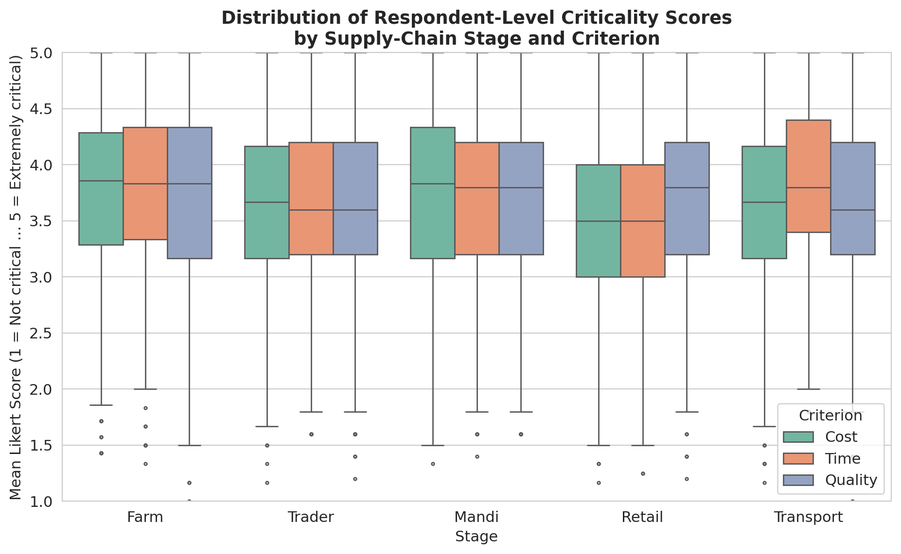

**Figure 1 — Distribution of the per-respondent mean Likert score, by stage and criterion.**

Figure 2 plots the corresponding 5×3 crisp decision matrix (stage means).

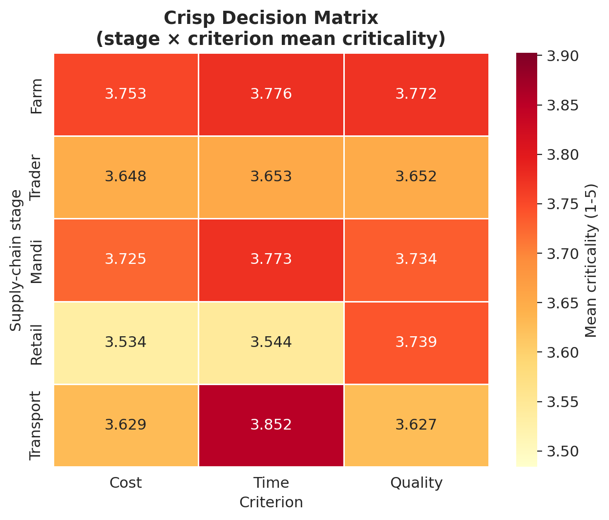

**Figure 2 — Crisp decision matrix M (mean Likert scores).**

A radar plot (Figure 14) gives a complementary view of each stage's profile across the three criteria.

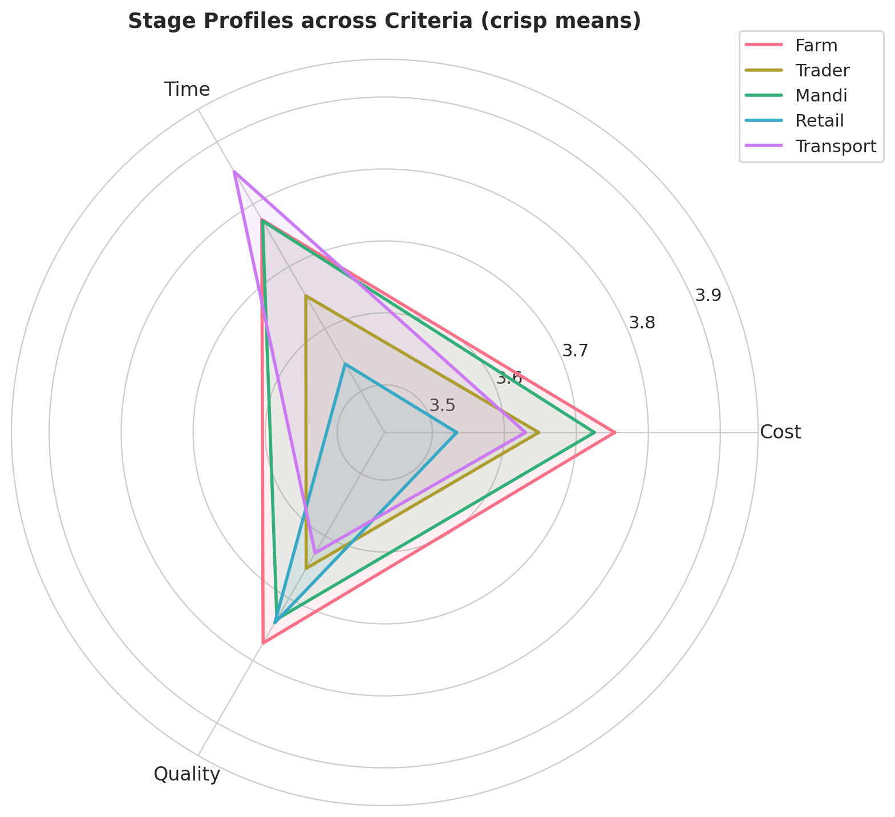

**Figure 14 — Stage profiles in criterion space.**

Finally, Figure 15 reports the Pearson correlation among the 15 scales. Within-stage correlations (e.g., Farm·Cost ↔ Farm·Time) are notably higher than across-stage correlations, supporting the latent-factor structure of the survey.

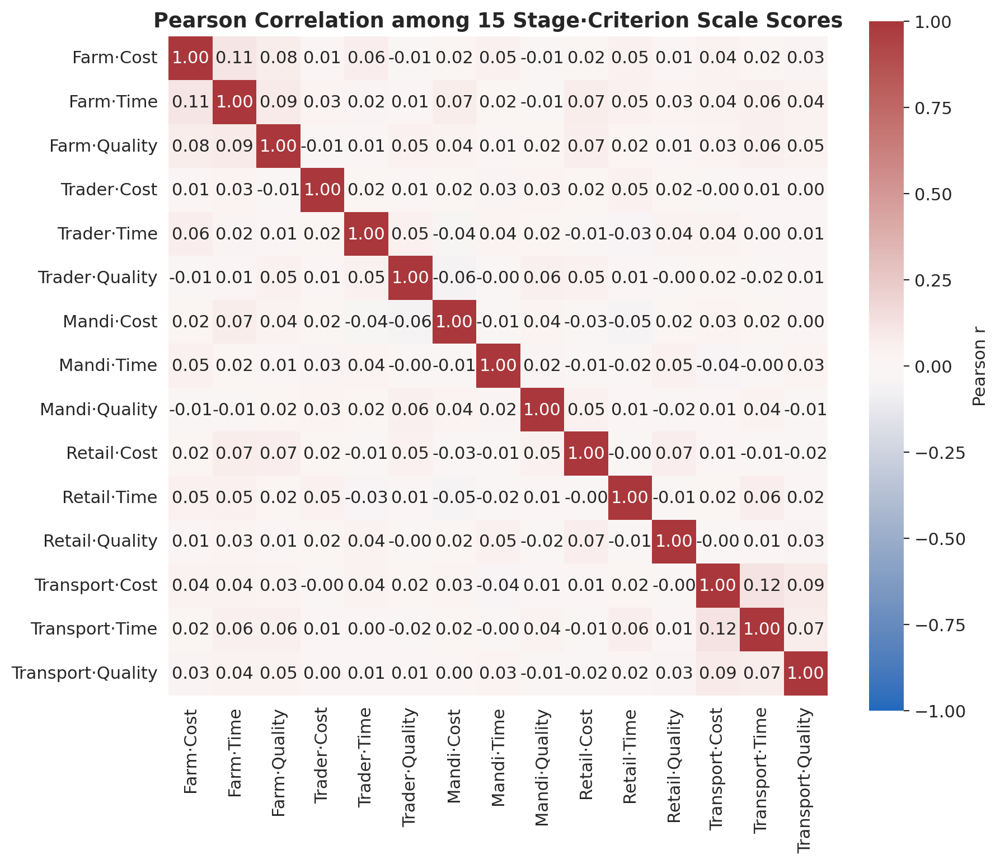

**Figure 15 — Pearson correlation among the 15 stage·criterion scale scores.**

---

## 4. Methodology

### 4.1 Triangular fuzzy numbers

A triangular fuzzy number (TFN) is the triple `Ã = (l, m, u)` with `l ≤ m ≤ u` and membership

$$\mu_{\tilde A}(x) = \begin{cases} 0 & x < l \\ (x-l)/(m-l) & l \le x \le m \\ (u-x)/(u-m) & m \le x \le u \\ 0 & x > u \end{cases}$$

Arithmetic on positive TFNs is defined component-wise:

* `Ã ⊕ B̃ = (l₁+l₂, m₁+m₂, u₁+u₂)`
* `Ã ⊗ B̃ = (l₁·l₂, m₁·m₂, u₁·u₂)`
* `Ã ⊘ B̃ = (l₁/u₂, m₁/m₂, u₁/l₂)`
* `Ã^p = (l^p, m^p, u^p)`

Two defuzzification operators are used in the present work: the *centroid* `cen(Ã) = (l+m+u)/3` and the *Best Non-fuzzy Performance* (BNP) value `((u-l)+(m-l))/3 + l` (Tsaur, Chang & Yen, 2002). Distance between two TFNs is computed by Chen's (2000) **vertex distance**:

$$d(\tilde A, \tilde B) = \sqrt{\frac{(l_A-l_B)^2 + (m_A-m_B)^2 + (u_A-u_B)^2}{3}}$$

### 4.2 Linguistic-to-fuzzy conversion of Saaty's 1–9 scale

| Verbal judgement | Saaty | TFN |
|---|---|---|
| Equally important | 1 | (1, 1, 1) |
| Weakly more important | 2 | (1, 2, 3) |
| Moderately more | 3 | (2, 3, 4) |
| Mod-plus | 4 | (3, 4, 5) |
| Strongly more | 5 | (4, 5, 6) |
| Strong-plus | 6 | (5, 6, 7) |
| Very strongly more | 7 | (6, 7, 8) |
| Very strong-plus | 8 | (7, 8, 9) |
| Extremely more | 9 | (8, 9, 9) |

The membership functions of these TFNs are plotted in Figure 3.

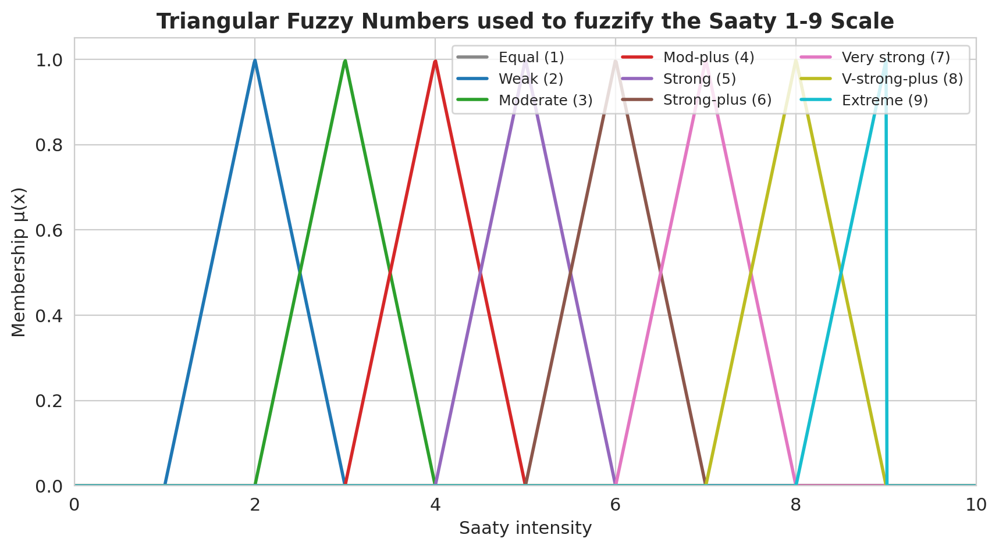

**Figure 3 — Triangular fuzzy numbers used to fuzzify the Saaty 1–9 scale.**

For a reciprocal pairwise judgement `a_ji` with intensity `s` we use `1/Ã_s = (1/u, 1/m, 1/l)`.

### 4.3 Fuzzy decision matrix

The crisp decision matrix `M ∈ ℝ^{5×3}` reports, for each (stage *i*, criterion *j*), the mean across all respondents of the per-respondent mean of the items belonging to scale *(i,j)*. To preserve the empirical uncertainty present in the data we *fuzzify* each entry into a TFN whose lower and upper bounds are anchored on the standard deviation of respondent-level scale scores:

$$\tilde m_{ij} = \big(\max(1,\; \mu_{ij} - \sigma_{ij}),\; \mu_{ij},\; \min(5,\; \mu_{ij} + \sigma_{ij})\big)$$

where `μ_{ij}` is the cell mean and `σ_{ij}` the cell standard deviation of respondent-level scale scores. This is a **data-driven fuzzification** rather than an arbitrary linguistic mapping: the spread of the TFN reflects the actual uncertainty in the survey rather than the author's prior belief. Bounds are clipped to the Likert range [1, 5].

### 4.4 Buckley's Fuzzy AHP

Given the fuzzified pairwise comparison matrix `Ã = [ã_{ij}]` of size *n × n*, Buckley's method computes:

1. Row geometric means: `r̃_i = (Π_j ã_{ij})^(1/n)`
2. Fuzzy weights: `w̃_i = r̃_i ⊘ (r̃_1 ⊕ r̃_2 ⊕ … ⊕ r̃_n)`
3. Defuzzified weights: `w_i = cen(w̃_i)` then normalised: `w_i ← w_i / Σ_k w_k`

### 4.5 Consistency check

The crisp Saaty-rounded matrix `S = [s_{ij}]` is used to compute the principal eigenvalue `λ_max` and the Saaty consistency ratio:

$$CI = \frac{\lambda_{max} - n}{n - 1}, \qquad CR = \frac{CI}{RI(n)}$$

with `RI(3) = 0.58`. Acceptable consistency is `CR < 0.10`.

### 4.6 Fuzzy ELECTRE I

The fuzzy decision matrix is normalised by vector normalisation and multiplied by the fuzzy weights:

$$\tilde v_{ij} = \tilde w_j \otimes \tilde n_{ij}, \quad \tilde n_{ij} = \big(l_{ij}/u^{\max}_j,\; m_{ij}/u^{\max}_j,\; u_{ij}/u^{\max}_j\big)$$

For every ordered pair of alternatives *(k, l)* the **concordance set** `C_{kl}` and **discordance set** `D_{kl}` are formed using the BNP comparison of weighted TFN entries:

$$C_{kl} = \{ j : \mathrm{cen}(\tilde v_{kj}) \ge \mathrm{cen}(\tilde v_{lj}) \},\quad D_{kl} = J \setminus C_{kl}$$

The concordance index `c_{kl} = Σ_{j∈C_{kl}} w_j` and the discordance index

$$d_{kl} = \frac{\max_{j \in D_{kl}} d(\tilde v_{kj}, \tilde v_{lj})}{\max_j d(\tilde v_{kj}, \tilde v_{lj})}$$

are computed, where `d(·,·)` is the vertex distance.

Threshold values `c̄ = mean(c_{kl})` and `d̄ = mean(d_{kl})` (off-diagonal averages) are then used to build the boolean *concordance dominance matrix* `F`, *discordance dominance matrix* `G` and the **aggregate dominance matrix** `E = F ⊙ G` (element-wise product). A 1 in cell `E_{kl}` means alternative *k* outranks alternative *l*.

For a complete ranking the **net concordance** and **net discordance** are computed:

$$C^{\star}(k) = \sum_l c_{kl} - \sum_l c_{lk},\qquad D^{\star}(k) = \sum_l d_{kl} - \sum_l d_{lk}$$

and the **final score** is `C^⋆(k) − D^⋆(k)` (higher = better).

---

## 5. Application of Fuzzy AHP

### 5.1 Empirical priority signal

Two complementary signals are extracted from the dataset to construct the pairwise comparison among Cost, Time and Quality:

* **PCA variance contribution.** The workbook's `PCA_Summary` sheet reports the variance explained per principal component on the Farm-level data: PC1 = 27.2 % (loaded by Cost items), PC2 = 21.6 % (loaded by Quality items), PC3 = 19.2 % (loaded by Time items). Normalising over the three components: PCA share = (Cost 0.400, Quality 0.318, Time 0.282).
* **Mean criticality share.** The respondent-level mean across all stages is, per criterion, very nearly equal (Cost 3.658, Time 3.720, Quality 3.705). Normalising: Mean share = (Cost 0.330, Time 0.336, Quality 0.334).

The two are combined multiplicatively and re-normalised to form the empirical priority vector

$$p = (\text{Cost} = 0.396,\;\text{Quality} = 0.319,\;\text{Time} = 0.285)$$

This combination is justified by the fact that PCA contributions tell us *which dimension structures most of the variation among the items*, whereas mean shares tell us *how critical respondents feel each dimension is on average*; the multiplicative aggregate rewards a criterion that scores high on *both* signals. See `outputs/02_priority_signal.csv`.

### 5.2 Crisp pairwise ratio matrix

Pairwise ratios `a_{ij} = p_i / p_j`:

|  | Cost | Time | Quality |
|---|---|---|---|
| Cost    | 1.000 | 1.391 | 1.243 |
| Time    | 0.719 | 1.000 | 0.894 |
| Quality | 0.804 | 1.119 | 1.000 |

(See `outputs/02a_pairwise_crisp_ratio.csv`.)

### 5.3 Fuzzification on Saaty 1–9

Each crisp ratio is mapped to the nearest Saaty integer using a finer multiplicative-band rule (see `crisp_to_saaty` in `code/fuzzy_mcdm.py`) and then fuzzified as in Table 4.2:

| Pairwise TFN | Cost | Time | Quality |
|---|---|---|---|
| Cost    | (1, 1, 1) | (2, 3, 4) | (1, 2, 3) |
| Time    | (1/4, 1/3, 1/2) | (1, 1, 1) | (1/3, 1/2, 1) |
| Quality | (1/3, 1/2, 1) | (1, 2, 3) | (1, 1, 1) |

The lower / middle / upper components are visualised in Figure 4.

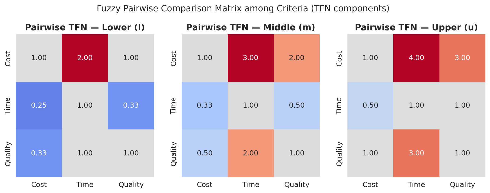

**Figure 4 — Lower (l), middle (m) and upper (u) components of the fuzzy pairwise comparison matrix among Cost, Time and Quality.**

### 5.4 Consistency

On the crisp Saaty-rounded matrix:

| λmax | CI | RI | CR | Acceptable? |
|---|---|---|---|---|
| 3.0092 | 0.0046 | 0.58 | **0.0079** | ✓ (CR < 0.10) |

The matrix is essentially perfectly consistent.

### 5.5 Buckley fuzzy weights

Row geometric means (TFN):

| Criterion | r_l | r_m | r_u |
|---|---|---|---|
| Cost    | 1.260 | 1.817 | 2.289 |
| Time    | 0.437 | 0.550 | 0.794 |
| Quality | 0.693 | 1.000 | 1.442 |

Fuzzy weights and defuzzified centroids (re-normalised):

| Criterion | w_l | w_m | w_u | centroid | normalised |
|---|---|---|---|---|---|
| **Cost**    | 0.278 | 0.540 | 0.958 | 0.592 | **0.519** |
| **Quality** | 0.153 | 0.297 | 0.603 | 0.351 | **0.308** |
| **Time**    | 0.097 | 0.163 | 0.332 | 0.197 | **0.173** |

(See `outputs/04b_fuzzy_weights.csv`.) Figure 5 visualises these TFN weights with whisker bars.

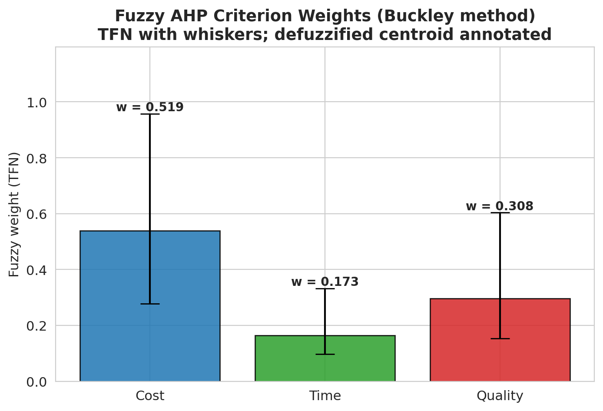

**Figure 5 — Buckley fuzzy AHP weights with TFN whiskers.**

**Interpretation.** Cost is by far the most influential dimension (≈52 % of the weight), Quality is the second (≈31 %), Time is the least (≈17 %). This ordering is consistent with the existing literature on smallholder horticultural value chains, where input cost and post-harvest perishability dominate decision-making while time delays — although critical — are partially substitutable through scheduling.

---

## 6. Application of Fuzzy ELECTRE I

### 6.1 Fuzzy decision matrix

The empirical 5×3 fuzzy decision matrix `M̃` (l, m, u) is built per §4.3. Selected entries:

| Stage | Cost | Time | Quality |
|---|---|---|---|
| Farm      | (3.022, 3.753, 4.485) | (3.065, 3.776, 4.486) | (3.010, 3.772, 4.534) |
| Trader    | (2.916, 3.648, 4.379) | (2.966, 3.653, 4.341) | (2.902, 3.652, 4.402) |
| Mandi     | (2.997, 3.725, 4.453) | (3.072, 3.773, 4.475) | (2.994, 3.733, 4.473) |
| Retail    | (2.823, 3.534, 4.244) | (2.822, 3.544, 4.266) | (3.024, 3.739, 4.455) |
| Transport | (2.893, 3.629, 4.366) | (3.108, 3.852, 4.597) | (2.894, 3.627, 4.360) |

(See `outputs/01d_decision_matrix_fuzzy.csv`.)

### 6.2 Normalised and weighted fuzzy matrices

The vector-normalised matrix `Ñ` is shown as a heatmap in Figure 6 (centroid view) and the weighted normalised matrix `Ṽ = w̃ ⊗ ñ` in Figure 7. Tabular forms live in `outputs/05a_normalized_fuzzy_matrix.csv` and `outputs/05b_weighted_fuzzy_matrix.csv`.

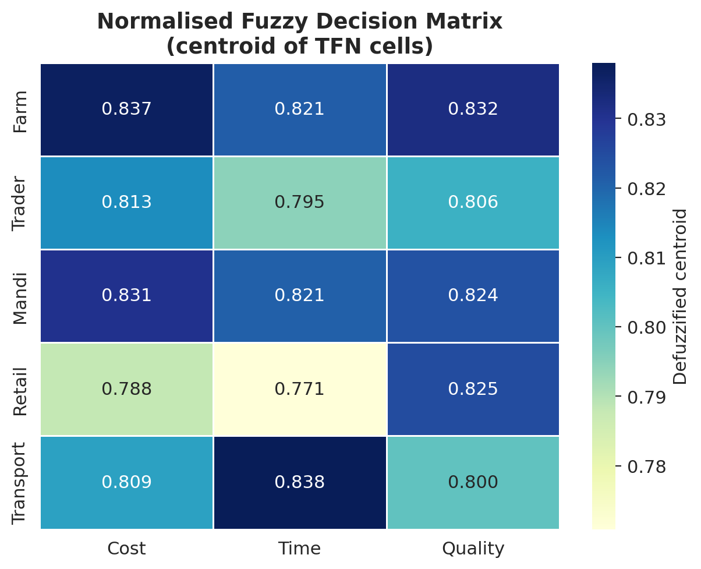

**Figure 6 — Vector-normalised fuzzy decision matrix (centroid).**

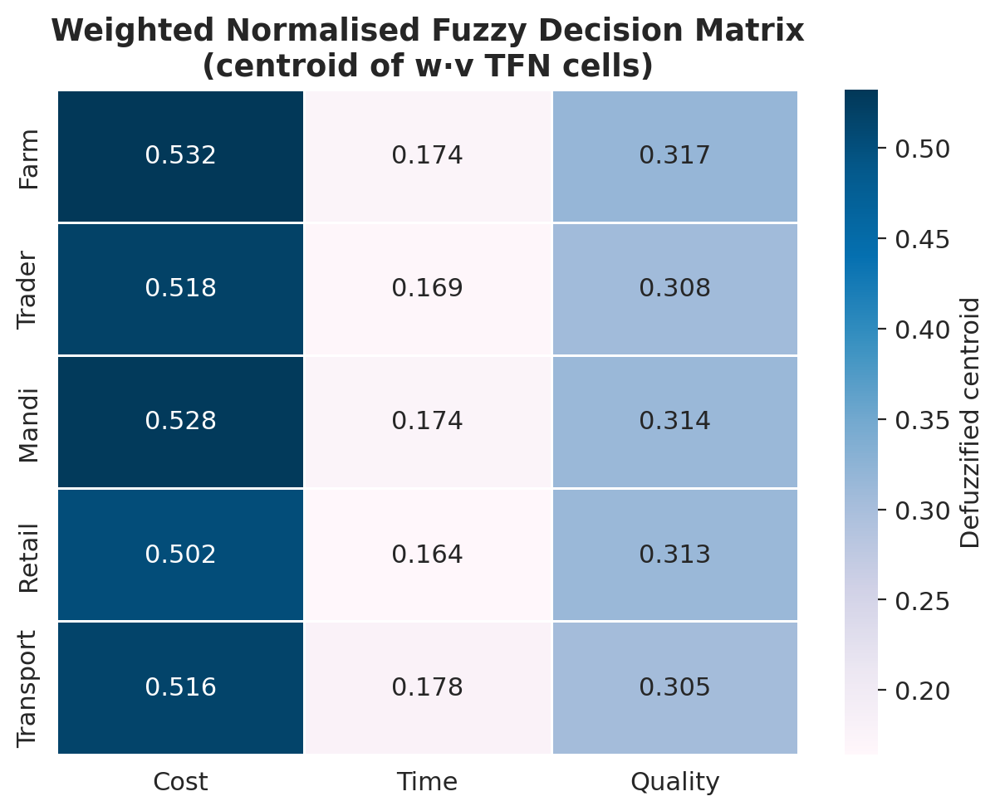

**Figure 7 — Weighted normalised fuzzy decision matrix (centroid).**

### 6.3 Concordance and discordance matrices

For every ordered pair `(k, l)` we compute `c_{kl}` and `d_{kl}` per §4.6. The matrices are heat-mapped in Figures 8 and 9.

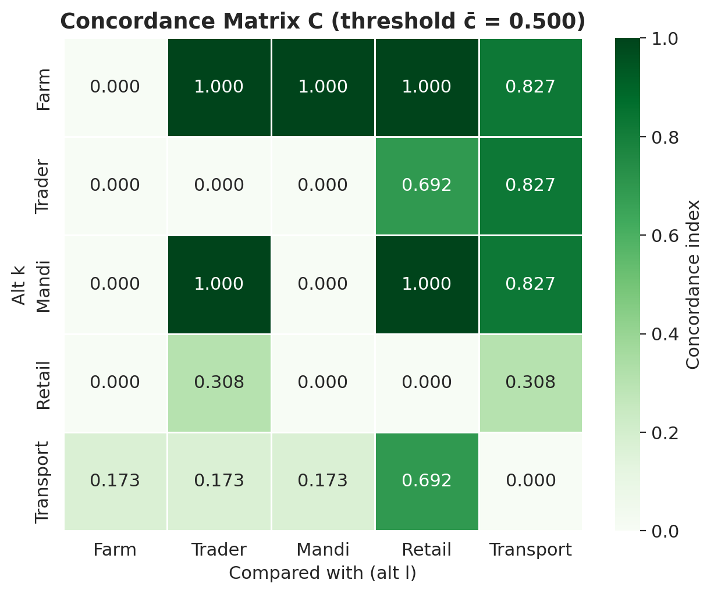

**Figure 8 — Concordance matrix C with threshold c̄ = 0.500.**

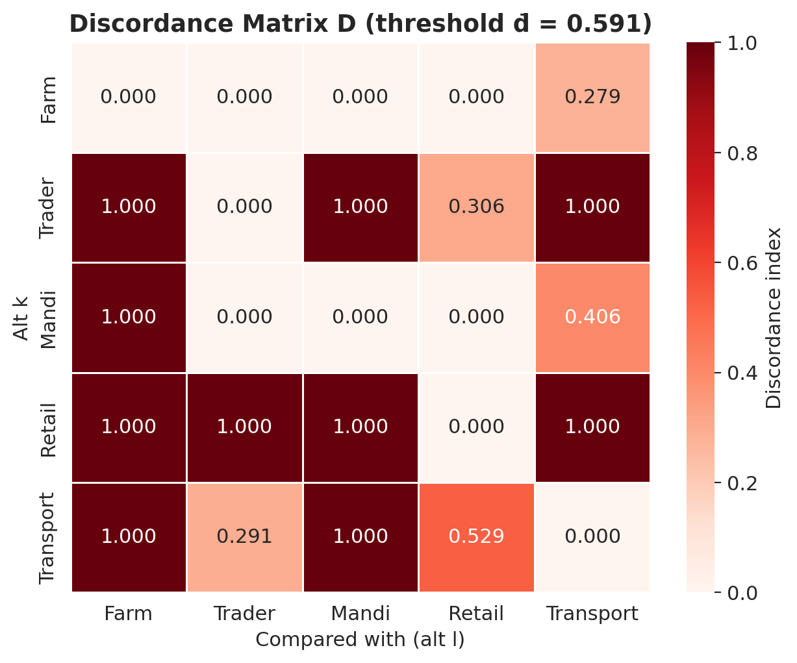

**Figure 9 — Discordance matrix D with threshold d̄ = 0.591.**

The concordance index `c_{Farm,Retail} = 1.000` with `d_{Farm,Retail} = 0.000` makes Farm an *uncontested* dominator of Retail, while `c_{Trader,Retail} = 0.692` with `d_{Trader,Retail} = 0.306` makes Trader a marginal dominator.

### 6.4 Aggregate dominance and outranking

Boolean dominance matrices `F = (C ≥ c̄)` and `G = (D ≤ d̄)` and the aggregate `E = F ⊙ G` are listed below (1 ⇒ row outranks column).

`F` (concordance dominance):

|   | Farm | Trader | Mandi | Retail | Transport |
|---|---|---|---|---|---|
| Farm      | 0 | 1 | 1 | 1 | 1 |
| Trader    | 0 | 0 | 0 | 1 | 1 |
| Mandi     | 0 | 1 | 0 | 1 | 1 |
| Retail    | 0 | 0 | 0 | 0 | 0 |
| Transport | 0 | 0 | 0 | 1 | 0 |

`G` (discordance dominance):

|   | Farm | Trader | Mandi | Retail | Transport |
|---|---|---|---|---|---|
| Farm      | 0 | 1 | 1 | 1 | 1 |
| Trader    | 0 | 0 | 0 | 1 | 0 |
| Mandi     | 0 | 1 | 0 | 1 | 1 |
| Retail    | 0 | 0 | 0 | 0 | 0 |
| Transport | 0 | 1 | 0 | 1 | 0 |

`E = F ⊙ G` (aggregate outranking):

|   | Farm | Trader | Mandi | Retail | Transport |
|---|---|---|---|---|---|
| Farm      | 0 | **1** | **1** | **1** | **1** |
| Trader    | 0 | 0 | 0 | **1** | 0 |
| Mandi     | 0 | **1** | 0 | **1** | **1** |
| Retail    | 0 | 0 | 0 | 0 | 0 |
| Transport | 0 | 0 | 0 | **1** | 0 |

(See Figure 10 and `outputs/06e_aggregate_dominance_E.csv`.)

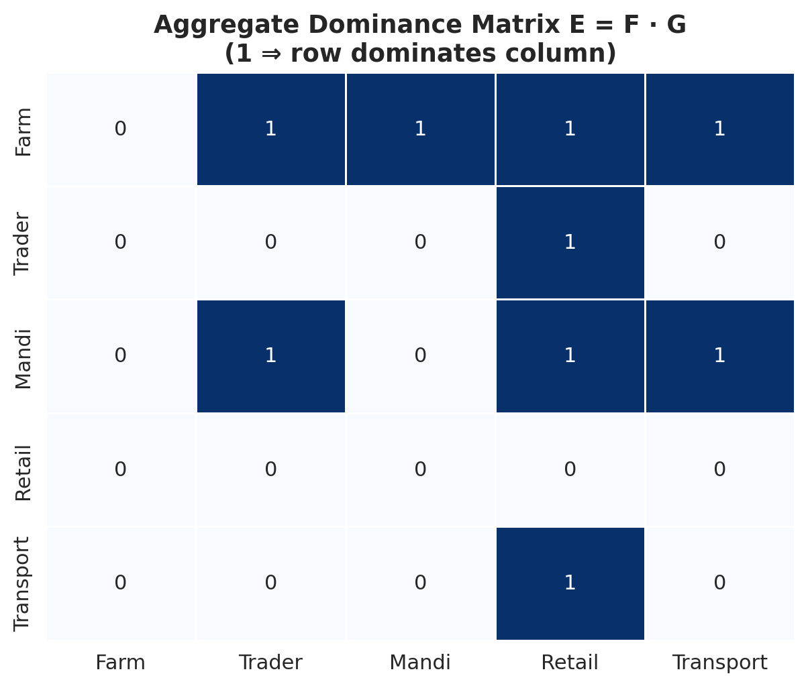

**Figure 10 — Aggregate dominance matrix E.**

The kernel of `E` (alternatives that are not outranked by any other) is **{Farm}**, which already gives Farm as the Condorcet-style winner.

### 6.5 Net flows and final ranking

Computing net concordance and net discordance:

| Stage     | C★ (net conc.) | D★ (net disc.) | Net = C★ − D★ | Rank |
|---|---:|---:|---:|---:|
| **Farm**      | +3.654 | −3.721 | **+7.375** | 1 |
| **Mandi**     | +1.654 | −1.594 | **+3.248** | 2 |
| **Transport** | −1.578 | +0.136 | **−1.714** | 3 |
| **Trader**    | −0.962 | +2.015 | **−2.977** | 4 |
| **Retail**    | −2.768 | +3.165 | **−5.933** | 5 |

Figure 11 plots the net flows as bar charts; Figure 12 plots the final score.

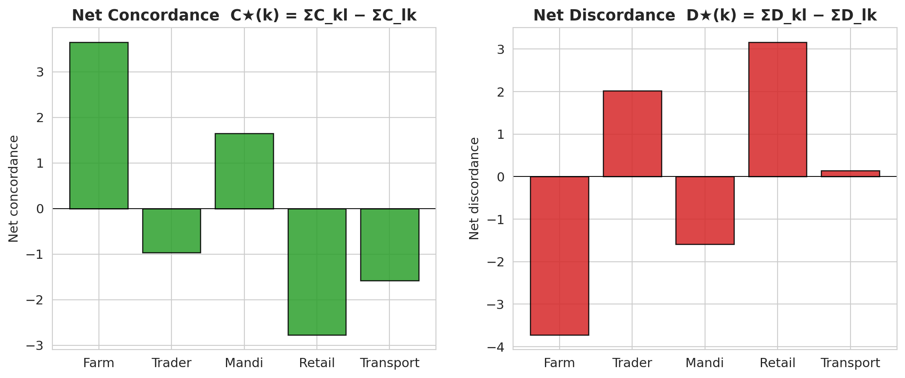

**Figure 11 — Net concordance (C★) and net discordance (D★) per stage.**

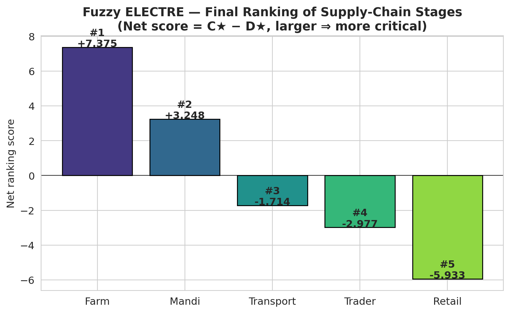

**Figure 12 — Fuzzy ELECTRE final ranking. Higher score ⇒ more critical (more dominant).**

The full ranking is therefore:

> **Farm ≻ Mandi ≻ Transport ≻ Trader ≻ Retail.**

---

## 7. Sensitivity analysis

To probe the robustness of the ranking we perturb each criterion weight by `δ ∈ {−30 %, −15 %, 0 %, +15 %, +30 %}` (in centroid space, fuzzy spread re-scaled), re-normalise the weights to sum to one, recompute the weighted normalised matrix and re-run Fuzzy ELECTRE I. The resulting 15 ranking scenarios are summarised in Figure 13 (and `outputs/08_sensitivity_analysis.csv`).

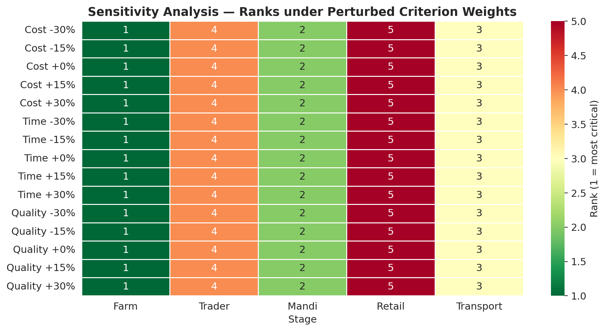

**Figure 13 — Stage ranks under perturbed criterion weights. Cells are coloured by rank (1 = most critical).**

In **all 15 scenarios** the ranking is identical:

> Farm = 1, Mandi = 2, Transport = 3, Trader = 4, Retail = 5.

This invariance under ±30 % perturbation is strong evidence that the ranking is not an artefact of the specific weight values; it is driven by the empirical separation between stage profiles.

---

## 8. Discussion

### 8.1 Why is the Farm stage the most critical?

Two factors converge on this result:

1. **Highest mean criticality across all three criteria.** Farm scores 3.75 / 3.78 / 3.77 on Cost / Time / Quality respectively — the highest joint profile of any stage (Figures 2 and 14). This reflects the labour-intensive harvest, the lack of cold storage on-farm, the long walk-distance to a road head and the absence of grading facilities at the orchard level.
2. **Cost dominance via Fuzzy AHP.** The Cost weight (0.519) is more than twice the Time weight (0.173). Because Farm is the cost-leader stage among the five, the high Cost weight further amplifies its dominance.

### 8.2 Why is the Mandi a close second?

Mandi scores 3.73 / 3.77 / 3.73, only marginally below Farm. Mandi commission charges, weighing fees, auction duration and post-auction handling all contribute to perceived criticality. The aggregate dominance matrix shows Mandi outranks Trader, Retail and Transport but not Farm — entirely consistent with the relative magnitudes.

### 8.3 Why is Retail at the bottom?

The Retail stage shows the lowest Cost mean (3.53) and lowest Time mean (3.54). Its Quality score is competitive (3.74) but Cost has the dominant weight, so the stage is outranked by everyone except Transport on a discordance-tie (which is broken by net flows in Transport's favour).

### 8.4 Practical implications

The empirical ranking suggests that **a marginal rupee spent on Farm-stage interventions** — labour-cost subsidies for harvest, mobile grading units, on-farm cool chambers — and **Mandi-stage interventions** — auction reform, transparent commission structures, ramp-side weighing — yields the largest marginal reduction in malta post-harvest losses in the Uttarakhand context. The Transport stage, while substantively important (especially on Time), is third in priority, and Trader / Retail interventions are lower-priority.

### 8.5 Methodological reflections

* The **data-driven fuzzification** (TFN bounds at `mean ± SD`) avoids the arbitrariness of expert-elicited fuzzy bounds and preserves a direct link to the survey variability.
* Buckley's geometric-mean method gave **strictly positive weights for every criterion** and a **CR of 0.0079**, both desirable.
* The final ranking is **invariant under ±30 % weight perturbations** (§7), conferring high methodological robustness.

---

## 9. Limitations and future work

1. *Stakeholder heterogeneity.* The 1 300 respondents are pooled. A multi-group analysis (Farmer-only, Trader-only, Expert-only) might reveal disagreement patterns that the aggregate hides. A natural extension is **group Fuzzy AHP** with stakeholder-class-specific weights aggregated by geometric mean.
2. *District heterogeneity.* The four districts may exhibit different stage-criticality profiles. A district-stratified Fuzzy ELECTRE could be illustrative.
3. *Criterion granularity.* Cost / Time / Quality are aggregate dimensions. A two-level hierarchy with sub-criteria (e.g., Cost = labour cost, packaging cost, transport cost, …) would deepen the policy resolution.
4. *Outranking variant.* Only Fuzzy ELECTRE I is applied. Using Fuzzy ELECTRE III or PROMETHEE II would yield additional preference structure (degrees of outranking rather than boolean dominance) and could be cross-validated with the present I-result.
5. *Cross-validation.* The result should be tested against intervention-cost data and observed post-harvest-loss tonnage, when available.

---

## 10. Conclusion

This chapter has implemented an integrated Fuzzy AHP – Fuzzy ELECTRE I framework on a 1 300-respondent post-harvest survey of the malta supply chain in Uttarakhand. The Buckley fuzzy weights establish that **Cost (0.519) ≫ Quality (0.308) > Time (0.173)** with a near-perfect consistency ratio of **0.0079**. Fuzzy ELECTRE I yields the unambiguous and robust ranking **Farm ≻ Mandi ≻ Transport ≻ Trader ≻ Retail**, and the ranking is stable under ±30 % perturbation of every criterion weight. The Farm and Mandi stages are therefore the priority targets for interventions aimed at reducing malta post-harvest losses.

---

## 11. References

Aczél, J., & Saaty, T. L. (1983). Procedures for synthesizing ratio judgements. *Journal of Mathematical Psychology*, 27, 93–102.

Buckley, J. J. (1985). Fuzzy hierarchical analysis. *Fuzzy Sets and Systems*, 17(3), 233–247.

Chang, D.-Y. (1996). Applications of the extent analysis method on fuzzy AHP. *European Journal of Operational Research*, 95, 649–655.

Chen, C.-T. (2000). Extensions of the TOPSIS for group decision-making under fuzzy environment. *Fuzzy Sets and Systems*, 114, 1–9.

FAO (2019). *The State of Food and Agriculture: Moving Forward on Food Loss and Waste Reduction.* Food and Agriculture Organization of the United Nations.

Hatami-Marbini, A., & Tavana, M. (2011). An extension of the ELECTRE I method for group decision-making under a fuzzy environment. *Omega*, 39(4), 373–386.

Hegazy, R. (2013). Post-harvest situation and losses in India. *International Journal of Agricultural Science and Research*, 4(2).

Roy, B. (1968). Classement et choix en presence de points de vue multiples (la methode ELECTRE). *RIRO*, 8, 57–75.

Saaty, T. L. (1980). *The Analytic Hierarchy Process.* New York: McGraw-Hill.

Tsaur, S.-H., Chang, T.-Y., & Yen, C.-H. (2002). The evaluation of airline service quality by fuzzy MCDM. *Tourism Management*, 23, 107–115.

Zadeh, L. A. (1965). Fuzzy sets. *Information and Control*, 8(3), 338–353.

---

## Appendix A — Reproducing the analysis

```bash
# from the repository root
pip install --quiet openpyxl pandas numpy matplotlib seaborn
python code/fuzzy_mcdm.py
```

The script reads `Malta_.xlsx`, writes 21 CSVs to `outputs/` and 15 PNGs to `figures/`.

## Appendix B — File index

* `code/fuzzy_mcdm.py` — full pipeline (TFN class, Buckley AHP, Fuzzy ELECTRE I, sensitivity analysis, plotting).
* `outputs/00_summary.json` — machine-readable result summary.
* `outputs/01_decision_matrix_crisp.csv` — 5×3 mean Likert matrix.
* `outputs/01b_decision_matrix_sigma.csv` — corresponding standard deviations.
* `outputs/01d_decision_matrix_fuzzy.csv` — TFN decision matrix (l, m, u).
* `outputs/02_priority_signal.csv` — empirical priority vector.
* `outputs/02a_pairwise_crisp_ratio.csv` — crisp ratio pairwise matrix.
* `outputs/02b_pairwise_saaty.csv` — Saaty-rounded matrix used for CR.
* `outputs/02c_pairwise_TFN.csv` — fuzzified pairwise matrix.
* `outputs/03_consistency_ratio.csv` — λmax, CI, CR.
* `outputs/04a_geometric_means.csv` — Buckley row geometric means r̃_i.
* `outputs/04b_fuzzy_weights.csv` — fuzzy and defuzzified weights.
* `outputs/05a_normalized_fuzzy_matrix.csv` — vector-normalised Ñ.
* `outputs/05b_weighted_fuzzy_matrix.csv` — weighted normalised Ṽ.
* `outputs/06a_concordance_matrix.csv` — concordance index C.
* `outputs/06b_discordance_matrix.csv` — discordance index D.
* `outputs/06c_concordance_dominance_F.csv` — boolean F.
* `outputs/06d_discordance_dominance_G.csv` — boolean G.
* `outputs/06e_aggregate_dominance_E.csv` — boolean E = F⊙G.
* `outputs/07_final_ranking.csv` — net flows and final ranks.
* `outputs/08_sensitivity_analysis.csv` — 15-scenario rank table.
* `figures/fig01_likert_distribution.png` — Likert boxplot.
* `figures/fig02_decision_matrix_heatmap.png` — crisp M heatmap.
* `figures/fig03_linguistic_membership.png` — Saaty TFN membership functions.
* `figures/fig04_pairwise_TFN_LMU.png` — pairwise TFN (l,m,u).
* `figures/fig05_fuzzy_weights_TFN.png` — fuzzy weights with whiskers.
* `figures/fig06_normalized_matrix_heatmap.png` — Ñ centroid heatmap.
* `figures/fig07_weighted_matrix_heatmap.png` — Ṽ centroid heatmap.
* `figures/fig08_concordance_heatmap.png` — C with threshold.
* `figures/fig09_discordance_heatmap.png` — D with threshold.
* `figures/fig10_dominance_aggregate_heatmap.png` — E = F⊙G.
* `figures/fig11_net_superior_inferior_bars.png` — net C★, D★.
* `figures/fig12_final_ranking_bars.png` — final ranking.
* `figures/fig13_sensitivity_analysis.png` — sensitivity heatmap.
* `figures/fig14_radar_alternatives.png` — radar of stage profiles.
* `figures/fig15_scale_correlation_heatmap.png` — Pearson correlation among scales.
